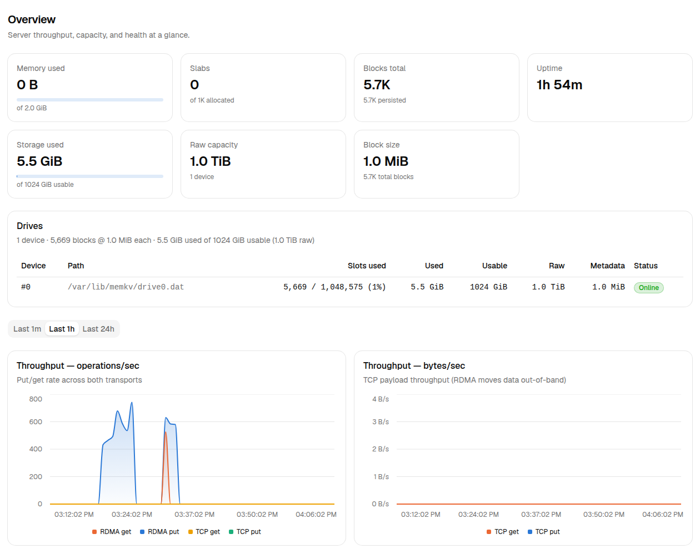

# AI agents on two DGX Sparks with MinIO MemKV

This repository holds everything behind our tests of AI agents on two NVIDIA DGX Sparks with MinIO MemKV: the setup files, the scripts that ran the tests, the raw measurements and screenshots.

Use it to set up the same system on your own DGX Sparks, to repeat the tests, or to check our numbers.

## What MemKV does here

An agent sends its whole session to the model with every request: its instructions, its tools, every file it read and every answer it gave. Before the model answers, it reads that prompt and builds a **KV cache**, a block of data for every token. vLLM keeps the KV cache in GPU memory and reuses it when the next request starts the same way.

GPU memory is small, and it is emptied when vLLM restarts. When a session's KV cache is gone, the model has to read the whole session again. For a session of 120,000 tokens, that takes about a minute on two DGX Sparks.

**MinIO MemKV** keeps a copy of the KV cache in a file on each DGX Spark's drive. When the GPU no longer has a block, vLLM loads it from MemKV over the network instead of computing it again.

## What we tested

We tested two open-source agents, each in its own sandbox, against the same server:

| Agent | Sandbox | How the sandbox limits the agent |
|---|---|---|
| [OpenClaw](https://github.com/openclaw/openclaw) 2026.9.8 | [NVIDIA OpenShell](https://build.nvidia.com/spark/openshell) 0.1.2 | A container. Network traffic is denied except to vLLM, and only from OpenClaw's own runtime. The vLLM API key stays outside the sandbox. Files outside the agent's home directory and `/tmp` are read-only. |
| [Hermes Agent](https://github.com/NousResearch/hermes-agent) 0.21.5 | [bubblewrap](https://github.com/containers/bubblewrap) 0.11.0 | A single command. The whole filesystem is read-only except Hermes's own state and an empty temporary directory. Hermes gets only its file tools, so it cannot run commands. |

Both agents studied the source code of [Apache Iceberg](https://github.com/apache/iceberg) (commit `c24eeea`) and could read it but not change it. Both talk to vLLM through its OpenAI-compatible endpoint, and neither needed any change to use MemKV.

The model was DeepSeek-V4-Flash, served by vLLM across both DGX Sparks.

## Set it up

You need:

- Two DGX Sparks connected by one cable between their ConnectX-7 network ports.
- A MemKV license. Email [sales@min.io](mailto:sales@min.io) and ask for a MemKV trial license.
- A computer for the agents, with Docker. OpenClaw, OpenShell and Hermes run there and reach vLLM over the network.

### 1. MemKV, on each DGX Spark

1. Install the MemKV server from [dl.minio.io/aistor/memkv](https://dl.minio.io/aistor/memkv/).
2. Make one shared key with `openssl rand -hex 32`. Every message between MemKV clients and servers is signed with it.
3. Copy [`setup/memkv/server.yaml`](setup/memkv/server.yaml) to `/etc/memkv/config.yaml` and put the shared key in it. `storage.mode: file` keeps KV in an ordinary 1 TiB file on the drive the DGX Spark ships with.
4. Start MemKV as a systemd service:

   ```
   memkv start --config /etc/memkv/config.yaml --license /etc/memkv/memkv.license
   ```

MemKV's web console runs on port 9901. It shows what MemKV stores and the RDMA traffic as vLLM reads and writes KV. The screenshots in [`images/`](images/) are from our runs.



### 2. vLLM with MemKV, across both DGX Sparks

We started vLLM with the community [spark-vllm-docker](https://github.com/eugr/spark-vllm-docker) recipe for DeepSeek-V4-Flash, which runs one model across two DGX Sparks.

1. On the first DGX Spark, clone spark-vllm-docker and this repository.
2. Put the vLLM API key you want in `~/.vllm-api-key`.
3. Copy [`setup/memkv/client.yaml`](setup/memkv/client.yaml) and your license to `~/.memkv/`, as `client.yaml` and `memkv.license`, and put the shared key in `client.yaml`.
4. Start vLLM:

   ```
   setup/vllm/launch.sh memkv my-namespace ~/vllm-logs/vllm.log
   ```

[`setup/vllm/launch.sh`](setup/vllm/launch.sh) installs the `memkv-vllm` plugin into the vLLM container and adds the MemKV settings to the recipe: the client config, a fixed hash seed so a restarted vLLM names KV blocks the same way, and `--kv-transfer-config`. It also sets `VLLM_PREFIX_CACHE_RETENTION_INTERVAL=4096`, as the DeepSeek-V4-Flash build for GB10 recommends, so vLLM keeps cached prefixes at 4,096-token steps. The namespace is a MemKV key prefix. A new namespace starts with an empty cache.

At startup vLLM logs `MemKV key prefix … from 2 worker ranks`. When sessions resume after a restart, vLLM's `vllm:external_prefix_cache_hits_total` metric rises.

To run vLLM without MemKV, for comparison, use `launch.sh nomemkv - <log-file>`.

### 3. OpenClaw in an OpenShell sandbox

1. Install OpenShell on the agent computer:

   ```
   curl -LsSf https://raw.githubusercontent.com/NVIDIA/OpenShell/main/install.sh | sh
   ```

2. Register vLLM as a provider. [`setup/openshell/spark-vllm.yaml`](setup/openshell/spark-vllm.yaml) names the one host and port the agent may reach, and the one program allowed to reach it. Replace the example host, 192.0.2.10, with your first DGX Spark's address.

   ```
   openshell profile import -f setup/openshell/spark-vllm.yaml
   VLLM_API_KEY=<your vLLM API key> openshell provider create --name spark-vllm --type spark-vllm --credential VLLM_API_KEY
   ```

3. Build the sandbox image: NVIDIA's OpenShell base image with Node.js 24 and OpenClaw, plus a read-only copy of Apache Iceberg at `/data/iceberg`.

   ```
   setup/openshell/image/build.sh
   ```

4. Create the sandbox and point OpenClaw at vLLM. [`setup/openshell/agent-policy.yaml`](setup/openshell/agent-policy.yaml) is the sandbox policy.

   ```
   VLLM_URL=http://192.0.2.10:8000 setup/openshell/setup-openclaw.sh openclaw
   ```

5. Ask a question:

   ```
   openshell sandbox exec -n openclaw -- \
     openclaw agent --local --session-id iceberg --json \
     --message "Read /data/iceberg/format/spec.md and explain how a table is laid out."
   ```

The setup script sets OpenClaw's context window to 1 million tokens, which is what our vLLM serves. OpenClaw's default is 128,000, and with it OpenClaw compacts long sessions early.

### 4. Hermes Agent in bubblewrap

1. Install Hermes Agent and bubblewrap (`apt install bubblewrap`).
2. Add the `model` section from [`setup/hermes/config.yaml`](setup/hermes/config.yaml) to `~/.hermes/config.yaml`, and put the vLLM API key in `~/.hermes/.env` as `SPARK_VLLM_API_KEY`.
3. Clone Apache Iceberg and remove write permission from the clone.
4. Ask a question with [`setup/hermes/run-hermes.sh`](setup/hermes/run-hermes.sh):

   ```
   setup/hermes/run-hermes.sh ~/iceberg "Read format/spec.md and explain how a table is laid out."
   ```

   To continue the session, pass the session ID that `hermes sessions list` shows as the third argument.

## Results

### An agent resumes its session after a vLLM restart

Each agent built up a long session, vLLM was restarted, and the agent asked a follow-up question in the same session. We ran each test once with MemKV and once without, from the same saved session. The table shows the median, with the range in brackets.

| | OpenClaw with MemKV | OpenClaw without | Hermes with MemKV | Hermes without |
|---|---|---|---|---|
| Session size when it resumed | 126,600 tokens (69,500–139,200) | same | 99,000 tokens (92,600–104,500) | same |
| Wait for the first word of the answer | **2.4 s** (2.0–6.6) | 58.7 s (31.2–68.5) | **2.5 s** (1.7–2.8) | 46.3 s (42.2–53.9) |
| Prompt tokens the GPUs computed over the whole answer | **17,300** (11,500–21,400) | 131,300 (94,800–150,300) | **14,800** (12,000–33,300) | 107,300 (94,700–114,000) |
| Time reading context over the whole answer | **15.1 s** (9.3–19.5) | 62.2 s (45.4–76.6) | **12.3 s** (8.7–23.1) | 52.0 s (43.5–61.8) |
| Data read from MemKV | 1.0 GB (0.57–1.09) | none | 0.78 GB (0.75–0.85) | none |
| Repetitions | 3 | 3 | 4 (first word: 3) | 4 (first word: 3) |

The two agents behave the same way. With MemKV, the session comes back in about 2 seconds, and the GPUs compute about a seventh of the tokens they compute without it. The tokens they still compute are the new question, the files the agent reads while answering, and its own replies.

The network cards show the same thing. With MemKV, the session's KV crosses the cable between the DGX Sparks in a burst of 1 to 2 seconds. Without it, the two GPUs spend 32 to 68 seconds recomputing the session and exchange 100 to 202 GB over the same cable while they do it.

### Forty agents share the server

Forty sessions, four at a time, each studied its own Iceberg topic: partitioning, snapshot expiration, deletion vectors, views, the REST catalog and 35 more. Together the sessions held far more KV than the GPUs can keep, so by the time a session came back to the server, the others had pushed its KV out of the GPU.

**OpenClaw.** From the same saved state, every session asked two more real questions, once with MemKV and once without. These were live agent turns: OpenClaw read more files, called its tools and wrote full answers. All 160 turns succeeded.

| 40 OpenClaw sessions, two rounds | With MemKV | Without MemKV |
|---|---|---|
| Prompt tokens the GPUs computed, round 1 | **0.55 million** | 4.61 million |
| Prompt tokens the GPUs computed, round 2 | **1.14 million** | 5.42 million |
| Share of all prompt tokens the GPUs computed | **1.8%** | 12% |
| Prompt tokens served per hour | **26.5 million** | 21.8 million |

**Hermes.** Every session asked three more questions. We recorded the request that opened each one and replayed those requests against a freshly started vLLM, round by round, asking for only the start of each answer. This measures how fast the server gets back to work, without the time the agent spends writing.

| 40 Hermes sessions | Median wait for the first word, with MemKV | Without MemKV | Prompt loaded from MemKV |
|---|---|---|---|
| Round 1: first visit | 236 s | 216 s | 6% |
| Round 2: sessions return | **28 s** | 237 s | 89% |
| Round 3: sessions return again | **86 s** | 297 s | 85% |
| Round 2, resending round 1's request unchanged | **4.8 s** | 172 s | 89% |

Round 1 is a little slower with MemKV, because MemKV stores every new block as vLLM computes it. Round 3 gains less than round 2 because its requests carry more new material that no cache has seen. In one run without MemKV, four replayed requests finished in vLLM but their responses never closed, so the client waited for its timeout and retried them. The round times in `data/hermes-fleet` include that idle time.

## Repeat the tests

The scripts in [`harness/`](harness/) run each test with no one at the keyboard, including stopping and starting vLLM. They run on the agent computer and reach the DGX Sparks over ssh. vLLM must run in tmux window 0 on the first DGX Spark.

Set these first, if yours differ from the defaults in [`harness/common.py`](harness/common.py): `VLLM_URL`, `VLLM_API_KEY`, `MEMKV_CONSOLES`, `SPARK_HOSTS`, `LAUNCH` and `LOG_DIR`.

| Test | Command |
|---|---|
| OpenClaw resumes after a restart | `python3 harness/openclaw_restart.py out/openclaw-restart 3` |
| 40 OpenClaw sessions | `python3 harness/openclaw_fleet.py out/openclaw-fleet` |
| Hermes resumes after a restart | `ICEBERG_SRC=~/iceberg python3 harness/hermes_restart.py out/hermes-restart 3` |
| 40 Hermes sessions | `python3 harness/hermes_fleet.py build`, then `ab` and `ab-same`. Run `hermes_task.py day1` first: it makes the read-only Iceberg clone the sessions read. |

The OpenClaw tests need the sandboxes from step 3: `openclaw` for the restart test, and `oc-w0` to `oc-w3` for the 40 sessions.

During each test, the scripts read vLLM's counters every half second, MemKV's counters, and the RDMA byte counters of both network cards on both DGX Sparks once a second.

Summarize a run, or our data, with [`harness/analyze.py`](harness/analyze.py):

```
python3 harness/analyze.py restart data/openclaw-restart
python3 harness/analyze.py openclaw-fleet data/openclaw-fleet
python3 harness/analyze.py hermes-fleet data/hermes-fleet
```

## What is in `data/`

| Directory | What it holds |
|---|---|
| `openclaw-restart/` | `results.jsonl`: the time window and MemKV bytes read for each run. `openclaw-r<n>-<arm>.json`: OpenClaw's answer, its own metadata and vLLM's counters over the run. `nic-*.jsonl`: network card counters. `metrics.jsonl`: vLLM's counters every half second. |
| `openclaw-fleet/` | `ocfleet-turns.jsonl`: one line per agent turn. `ocfleet-windows.jsonl`: when each round ran. `ocfleet-counters-*.jsonl`: vLLM and MemKV counters every 10 seconds. |
| `hermes-restart/` | The same files as `openclaw-restart/`, for Hermes. Run 1 has no half-second counters, so its wait for the first word is not known. |
| `hermes-fleet/` | `hfleet-<run>.jsonl`: one line per replayed request. `hfleet-counters-*.jsonl`: counters every 10 seconds. `answers/`: every Hermes answer. Runs named `same-` resend round 1's request in every round. |

## Versions

| Component | Version |
|---|---|
| MemKV server | RELEASE.2026-10-05T18-19-23Z |
| MemKV vLLM plugin (`memkv-vllm`) | 1.0.11, from PyPI |
| vLLM | 0.1.dev21553+gab86b7073, from the spark-vllm-docker build for GB10 |
| PyTorch, CUDA, NCCL | 2.13.0+cu130, 13.0, 2.29.7 |
| Model | deepseek-ai/DeepSeek-V4-Flash-0731 (revision 7872f01b) |
| GPU driver | 580.178.04, open kernel module |
| Operating system | DGX OS 7.6.0 (Ubuntu 24.04.5), kernel 7.0.0-1019-nvidia |
| OpenClaw | 2026.9.8, on Node.js 24.21.0 |
| NVIDIA OpenShell | 0.1.2, base sandbox image sha256:aeef1c63… |
| Hermes Agent | 0.21.5 (2026.9.24) |
| bubblewrap | 0.11.0 |
| Apache Iceberg | commit c24eeea |
